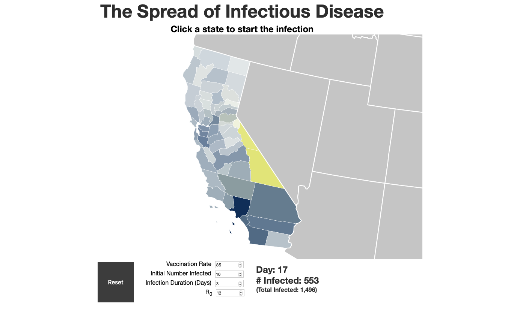

sir-simulation
==============



A simulation of the [SIR model](https://en.wikipedia.org/wiki/Compartmental_models_in_epidemiology#The_SIR_model), a model used to predict the spread of disease over time.

[](https://dev.azure.com/amilajack/amilajack/_build/latest?definitionId=16&branchName=master)

## Live Demo

See the demo at [amilajack.github.io/sir-simulation](https://amilajack.github.io/sir-simulation/)

## Local Setup

```bash
git clone https://github.com/amilajack/sir-simulation
cd sir-simulation
# If you don't have yarn, run `npm i -g yarn` first
yarn
yarn start
```
